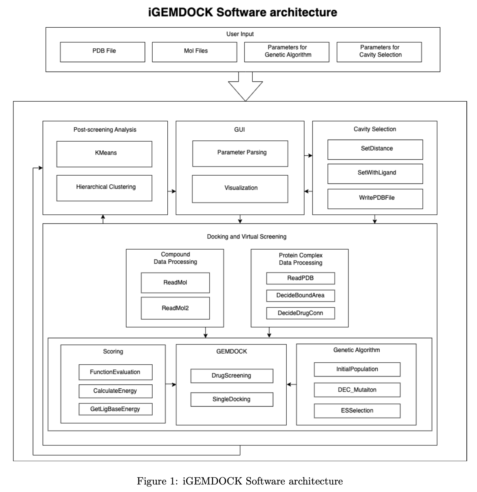
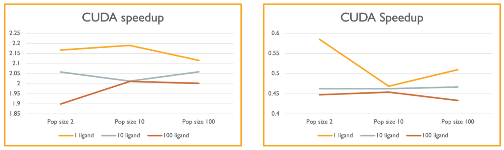

# Parallel-Programming
## Final Project : GPU Acceleration for iGEMDOCK ( A Molecular Docking Software )
### Issue
Virtual screening relies heavily on computing the interaction energies between each ligand atom and every atom within a protein’s binding cavity. In iGEMDOCK, this step—known as fitness evaluation—is the most computationally expensive part of the workflow. As the number of ligands or the size of the ligand increases, the $O(N \times M)$ pairwise energy calculations quickly become a bottleneck, significantly slowing down the entire screening process.  

**Figure 1.** System Architecture Overview
### Method
To accelerate this bottleneck, we parallelized iGEMDOCK’s energy computation using CUDA. The three energy functions (Van der Waals, hydrogen bonding, and electrostatic interactions) were rewritten as device functions, and both ligand and protein cavity atoms were transferred to GPU memory. Each GPU thread was assigned to compute the interaction energies for a single cavity atom against all ligand atoms. After all threads completed their computations, the results were collected on the CPU and integrated into the fitness evaluation step, enabling efficient GPU-based parallelism.
### Results
The CUDA implementation achieved clear speedup over CPU execution across most test scenarios. However, the effectiveness of parallelization decreased when the atom counts between the protein cavity and the ligand were highly imbalanced. Factors such as thread load imbalance, memory access efficiency, and host-device data transfer overhead contributed to this reduction. Overall, CUDA provides significant benefits for large ligands with higher atom counts, while CPU-based multithreading may remain advantageous for smaller ligands. 

**Figure 2.** Speedup Result of 2 Datasets

## HW0 : Warm up
Familiar with Makefile and C/C++ programming.

## HW1 : SIMD Programming
Familiarize yourself with SIMD (single instruction, multiple data) programming  
1. Vectorizing Code with Automatic Vectorization Optimizations

## HW2 : Multi-thread
Familiarize yourself with Pthread and std::thread programming in C and C++, respectively.  
1. Part 1: Parallel Counting PI Using Pthreads
2. Part 2: Parallel Fractal Generation Using std::thread

## HW3 : OpenMP Programming
1. Part 1: Parallelizing Conjugate Gradient Method with OpenMP
2. Part 2: Parallelizing PageRank Algorithm with OpenMP

## HW4 : MPI Programming
0. Setting Up the Environment
1. Getting Familiar with MPI Programming

## HW5 : CUDA Programming
1. Problem Statement: Paralleling Fractal Generation with CUDA

## HW6 : OpenCL Programming
1. Image convolution using OpenCL